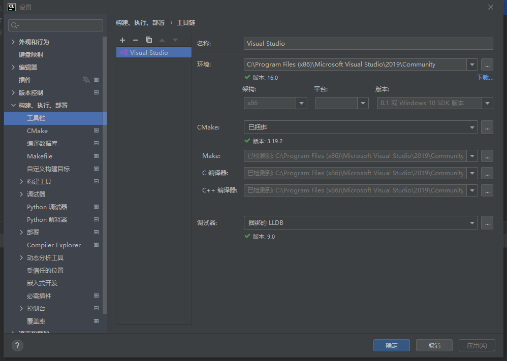
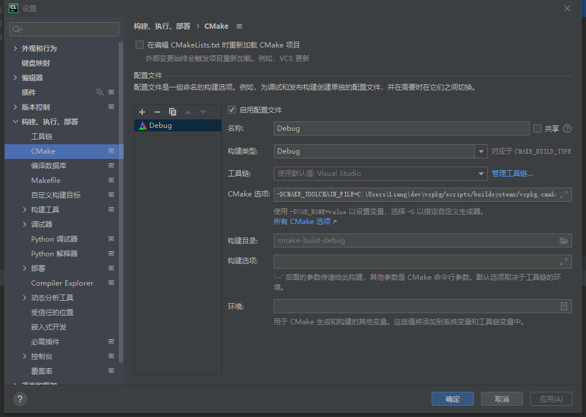

# vcpkg+CMake+Boost使用

虽然vcpkg能够方便的安装部分C++第三方库，但是对于通过vcpkg和CMake工具使用Boost有少许特别，另起篇幅记录

有关如何安装vcpkg，请见

- [vcpkg安装及使用(Windows)](../vcpkg_install_windows.md)

## 题外话：编码洁癖

在Boost库的过程中，经常会用到很多宏定义，但是使用Boost中的宏定义很容易引发CLion中的警告(`Initialization of 'xxx' with static storage duration may throw an exception that cannot be caught`)，这样的话在编码得时候看起来很烦

有一种临时的解决方案是，在这些用到Boost宏所在的行后面加注释`/* NOLINT */`或者`//NOLINT`，这样就会取消来自CLion的警告，但是此做法只适合消除Boost宏带来的警告，不建议在其他类型的警告上使用此方法，毕竟CLion给出的警告大部分都很有用

## 配置CLion

### 配置工具链及CMake

配置路径为`文件`->`设置`->`构建、执行、部署`中的`工具链`及`CMake`，我这里直接使用的是visual studio的工具链，并额外安装了CMake的3.19版本([下载链接](https://cmake.org/download/))

我的配置如下





#### 注意事项

一定要记得给cmake配置CMake选项，内容为

```
-DCMAKE_TOOLCHAIN_FILE=${vcpkg_dir}/vcpkg/scripts/buildsystems/vcpkg.cmake
```

其中`${vcpkg_dir}`是你的vcpkg安装目录

## 使用Boost测试框架

这次要用到的是Boost库中的test测试框架，这个Boost组件需要使用动态链接库进行连接(也可以用纯头文件的方式，但是这里为了说明vcpkg和CMake的用法，使用动态链接库)

### 文件结构

```
.
├── CMakeLists.txt
├── common.h
├── main.cpp
└── primaryAlgorithms
    ├── array.cpp
    └── array.h
```

### 源代码

#### CMakeLists.txt

```cmake
cmake_minimum_required(VERSION 3.19)
project(leetcode)

set(CMAKE_CXX_STANDARD 17)

add_executable(leetcode main.cpp primaryAlgorithms/array.cpp)

target_include_directories(leetcode PRIVATE
        common.h
        primaryAlgorithms/array.h
)

# vcpkg
find_package(Boost REQUIRED COMPONENTS
        unit_test_framework
)
target_include_directories(leetcode PUBLIC
        ${Boost_INCLUDE_DIRS}
        ${CMAKE_SOURCE_DIR}
)
target_link_libraries(leetcode ${Boost_LIBRARIES})
```

#### array.h/cpp

```c++
#include <common.h>

/*
 * 给你一个有序数组nums，请你原地删除重复出现的元素，使每个元素只出现一次，返回删除后数组的新长度
 * 不要使用额外的数组空间，你必须在原地修改输入数组并在使用O(1)额外空间的条件下完成
 * */
int removeDuplicates(std::vector<int>& nums) {
    // 排除边界情况
    if (nums.empty()) {
        return 0;
    }
    if (nums.size() == 1) {
        return 1;
    }
    // 迭代器移动的次数加一就是结果数组的大小
    int arraySize = 1;
    auto left = nums.begin();
    for (auto right = left + 1; right != nums.end(); right++) {
        if (*left != *right) {
            left++;
            arraySize++;
            *left = *right;
        }
    }
    return arraySize;
}
```

```c++
#include "array.h"

#include <boost/test/unit_test.hpp>

BOOST_AUTO_TEST_SUITE(s_array)  /* NOLINT */

BOOST_AUTO_TEST_CASE(c_removeDuplicates) {  /* NOLINT */
    std::array<std::vector<int>, 5> inputArray {
            std::vector<int>{0, 0, 1, 1, 2, 2, 3, 3},
            std::vector<int>{0, 0, 0, 1, 1, 1, 2, 3},
            std::vector<int>{0, 1, 2, 3, 4, 5, 6, 7},
            std::vector<int>{0, 0, 0, 0, 0, 0, 0, 0},
            std::vector<int>{}
    };
    std::array<std::vector<int>, 5> outputArray {
            std::vector<int>{0, 1, 2, 3},
            std::vector<int>{0, 1, 2, 3},
            std::vector<int>{0, 1, 2, 3, 4, 5, 6, 7},
            std::vector<int>{0},
            std::vector<int>{}
    };
    int index = 0;
    for (auto& v: inputArray) {
        int arraySize = removeDuplicates(v);
        BOOST_REQUIRE_EQUAL(arraySize, outputArray.at(index).size());
        int anotherIndex = 0;
        for (auto& i: outputArray.at(index)) {
            BOOST_REQUIRE_EQUAL(i, v.at(anotherIndex));
            anotherIndex++;
        }
        index++;
    }
}

BOOST_AUTO_TEST_SUITE_END()  /* NOLINT */
```

除此以外，还需要一个主测试夹具，单独写在`main.cpp`中

```c++
#define BOOST_TEST_DYN_LINK
#define BOOST_TEST_MAIN
#include <boost/test/unit_test.hpp>
```

### 构建及运行

CLion本身是支持Boost测试框架的，可以很方便的运行测试用例
