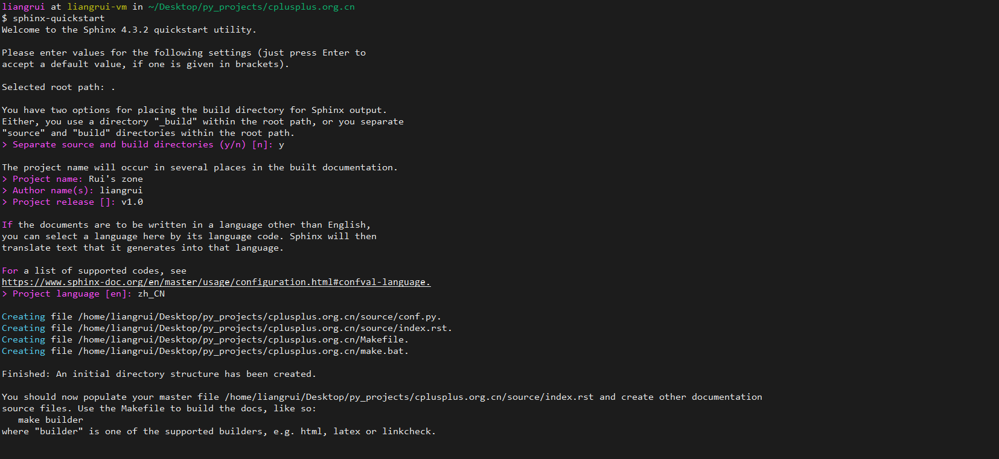
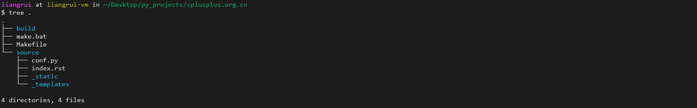
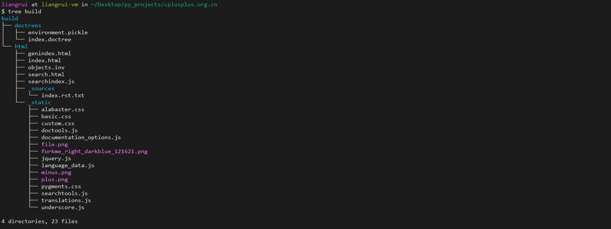

# 用Sphinx +Python搭建在线文档

参加工作快两年了，也不是第一次使用Sphinx +Python搭建页面，但是因为懒，很多工作中收获的编程技巧和框架都没有沉淀下来，于是现在把在线文档捡起来，将工作中不断实践的技术路线沉淀下来。

有关Sphinx的介绍，还没有了解的话可以自行百度。

- [中文官网](https://zh-sphinx-doc.readthedocs.io/en/latest/contents.html)

- [英文官网](https://www.sphinx-doc.org/)

> 默认环境是搭建在Ubuntu环境下，不熟悉Linux操作的同学请先入门Linux操作

## 1 安装 Sphinx

最方便的方法是使用**apt-get**命令安装：

```shell
sudo apt-get install python3-sphinx
```

更多安装方式可以参考官方提供的介绍：[Install Sphinx](https://link.jianshu.com/?t=http://www.sphinx-doc.org/en/stable/install.html)。

## 2 创建工程

没有什么特殊需求的话，直接在官方提供的[快速开始](https://www.sphinx-doc.org/en/master/usage/quickstart.html)项目的基础上修改即可：

```shell
mkdir cplusplus.org.cn && cd cplusplus.org.cn
sphinx-quickstart
```

其中有一些需要输入的基本信息，根据自己的情况输入即可：



创建成功后，目录结构如下图所示：



- build目录

  用于保存构建输出的目录

- source目录

  用于放置文档的源文件(.md/.rst)

- make.bat

  批处理脚本

- Makefile

### 2.1 让页面显示在浏览器中

可以看到，在使用`sphinx-quickstart`之后，在`source`目录下生成了默认的一个索引文件`index.rst`。

为了第一时间看到静态网页的效果，先不对其进行编辑，在项目目录下执行：

```shell
make html
```

执行完毕后，可以看到在`build`目录下，生成了如下结构的文件：



接下来就是托管静态网页，据我了解有以下几种方法：

- Github+ReadtheDocs代理
- Nginx/Apache代理
- Django代理

这其中，我只尝试过使用Nginx进行网页托管，并且使用Nginx代理也应该是最方便、稳定、成熟的一种方式。，而对于Nginx服务器的安装和部署，已经不再属于本文的主线内容，可以直接使用`sudo apt-get install nginx`在本机进行安装，也可以参考菜鸟教程中关于Nginx安装的描述：[Docker 安装 Nginx](https://www.runoob.com/docker/docker-install-nginx.html)。

安装完成Nginx服务后，找到Nginx默认的`index.html`所在目录，我的是`/usr/share/nginx`，直接将刚刚build目录下生成的`html`文件拷贝到`/var/www`：

```shell
sudo cp -r html /var/www
# 重新启动Nginx服务
sudo nginx -s reload
```

接下来在浏览器中输入`127.0.0.1`就可以看到生成的默认界面了。


